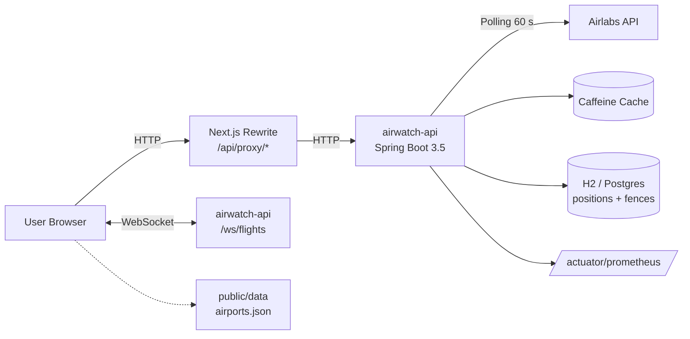
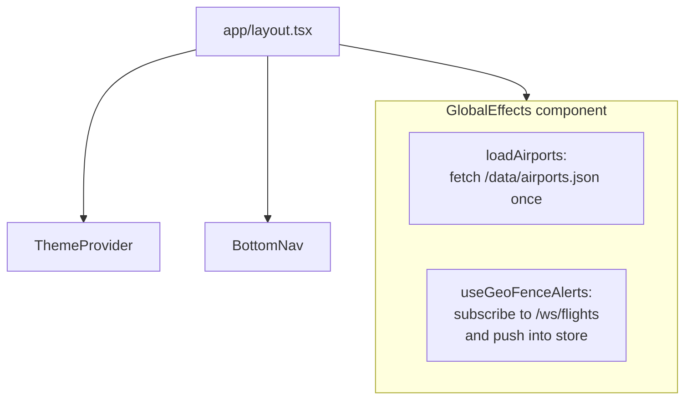
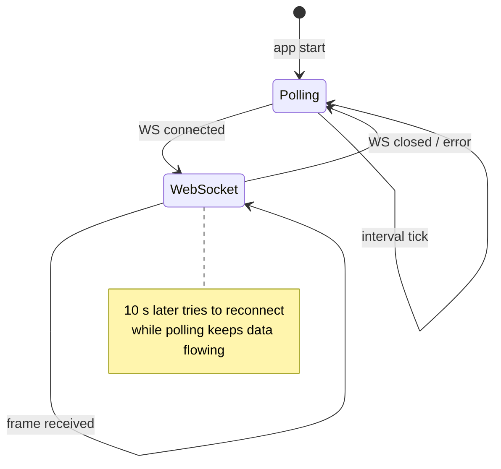
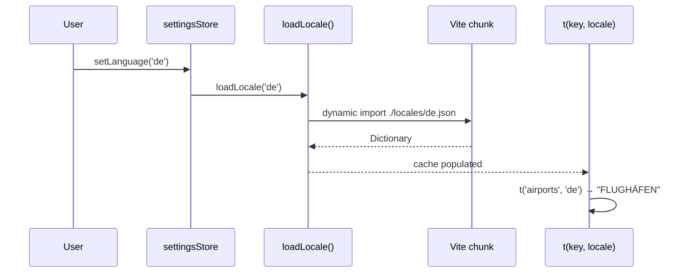
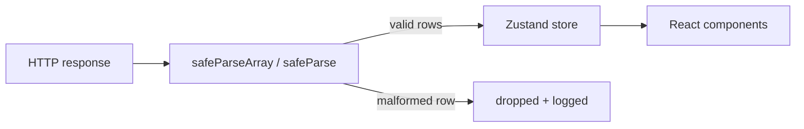

# AirWatch Web · Architecture

Reading time ~ 8 min. Read this before making structural changes.

## High-level data flow



* Every `fetch` from the browser that targets `/api/proxy/*` is rewritten by
  Next.js to `http://localhost:8080/*` (configurable via `NEXT_PUBLIC_PROXY_URL`).
* Live flight frames stream over the same-origin WebSocket `/ws/flights`.
  The [`liveFeed`](./src/lib/flights/liveFeed.ts) transport automatically falls
  back to HTTP polling when the socket drops.

## Folder layout

```
src/
├── app/                # Next.js App-Router pages
│   ├── /              ─ map home
│   ├── airports/      ─ airport search + detail
│   ├── airlines/      ─ airline detail
│   ├── cargo/         ─ cargo tracking
│   ├── dashboard/     ─ multi-airport dashboard
│   ├── geofences/     ─ CRUD + draw
│   ├── replay/        ─ flight playback
│   ├── saved/         ─ favorites
│   ├── search/        ─ global search
│   ├── settings/      ─ theme / units / language
│   ├── spotting/      ─ geolocation spotting
│   └── stats/         ─ personal flight stats
├── components/
│   ├── common/        ─ FlagImage, LogoImage, ManagedImage
│   ├── flight/        ─ FlightDetailsPanel + details/ subfolder
│   ├── geofence/      ─ GeoFenceDrawMap (Leaflet-Draw)
│   ├── layout/        ─ BottomNav, ThemeProvider, GlobalEffects
│   ├── map/           ─ MapView + hooks (markers, labels, radar, routes)
│   ├── replay/        ─ FlightReplayMap
│   ├── search/        ─ SearchInput, ResultTile
│   └── ui/            ─ NeonText, GlassPanel, StatusBadge (atoms)
└── lib/
    ├── apiFetch.ts    ─ fetch wrapper with typed error logging
    ├── constants.ts   ─ API URL builder, colors, config defaults
    ├── data/          ─ airports lazy-loader, airlines, city/country i18n
    ├── flights/       ─ airlabs schemas, liveFeed, REST clients
    ├── hooks/         ─ useMounted, useGeoFenceAlerts, useSquawkAlerts, …
    ├── i18n/          ─ TranslationKey union, lazy locale loader
    ├── schemas.ts     ─ Zod runtime validators (API boundary)
    ├── stores/        ─ Zustand stores (flights, favorites, stats, …)
    ├── types/         ─ shared TS types
    └── utils/         ─ formatting, math, conversion
```

## Global effects on mount



* `GlobalEffects` is a client-only `null`-render component mounted at the
  root layout. It warms the airports cache and opens the long-lived WebSocket
  that delivers geo-fence alerts.

## State management

Each Zustand store owns a single concern. Stores persist to `localStorage`
where appropriate.

| Store | Persists? | Purpose |
|---|---|---|
| `flightStore` | no | live aircraft map, polling/WS handle, selection |
| `favoritesStore` | yes | user's starred flights / airports / airlines |
| `statsStore` | yes | personal view counter, capped at 500 entries |
| `settingsStore` | yes | theme, language, units, mapStyle, updateInterval |
| `geofenceStore` | yes | alert history (deduped, capped at `maxAlerts`) |

### Live-feed transport



## i18n pipeline



* `en.json` is eager-bundled (fallback).
* `de.json` / `fr.json` are code-split — Next.js emits them as separate chunks.
* `TranslationKey = keyof typeof enDictionary` gives compile-time safety.

## API boundary validation

Every fetch-result is parsed through a Zod schema before entering React state:



Single malformed entries are dropped, not fatal. Envelope-level failures log
and return an empty array so the UI degrades gracefully.

## Backend coupling

The frontend only knows the backend via `/api/proxy/*` and `/ws/flights`.
Contract drift is caught by:

1. Zod schemas at every fetch boundary
2. `npm run generate:api-types` — regenerates from SpringDoc OpenAPI when
   backend is running
3. [`contract.test.ts`](./src/lib/contract.test.ts) — executable shape docs

## Build & deploy

| Step | Tool |
|---|---|
| Dev | `npm run dev` (port 3000, LAN-bind) |
| Build | `npm run build` (Next.js 16 + Turbopack) |
| Test | `npm test` (Vitest, multi-env) |
| E2E | `npm run test:e2e` (Playwright) |
| Lint | `npm run lint` (ESLint 9 flat config) |
| Size | `npm run size` (size-limit, raw JS + CSS) |
| Container | `docker build -t airwatch-web .` |

## Performance budgets

| Asset | Limit | Current |
|---|---|---|
| JS chunks total (raw) | 2.5 MB | 1.6 MB |
| CSS chunks total (raw) | 150 KB | 66 KB |
| First airports fetch | — | ~500 KB (cached hard) |
| Locale chunks (DE/FR) | — | ~15 KB each |

## Adding a new feature

1. **Type contract first** — add the schema to [`src/lib/schemas.ts`](./src/lib/schemas.ts)
   or a feature-local schema file.
2. **REST client** under `src/lib/flights/` using `apiFetch` + `safeParse`.
3. **Store** under `src/lib/stores/` (Zustand). Persist only when it's user data.
4. **Component(s)** with tests colocated (`Component.test.tsx`).
5. **Translations** — add a key to `en.json`; DE/FR follow. The parity test
   fails fast if you forget one.
6. **E2E smoke** — add a spec in `e2e/` if the feature has its own route.

## Deliberate non-goals

* No user accounts — `clientId` comes from `localStorage`.
* No offline-first — relies on backend for live data. Cached airports and
  i18n bundles are the only persistent assets.
* No native mobile apps — web only, no PWA manifest yet.
