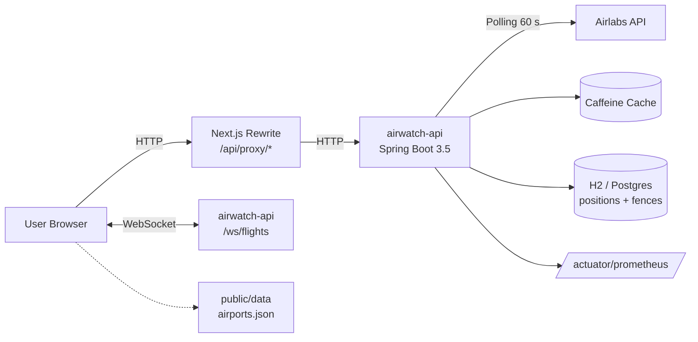
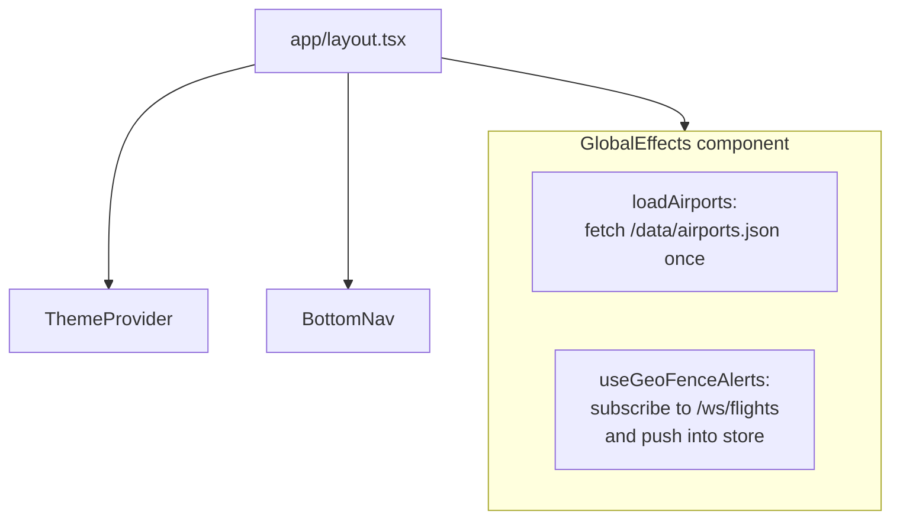
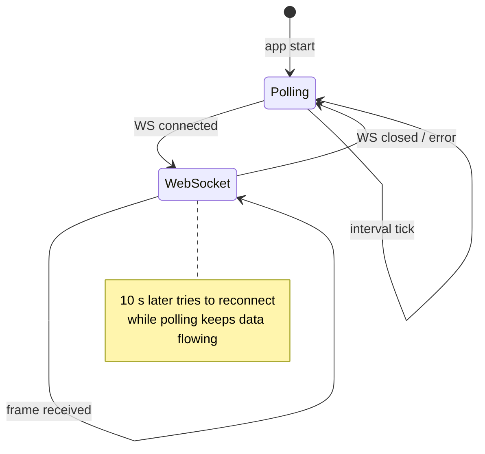
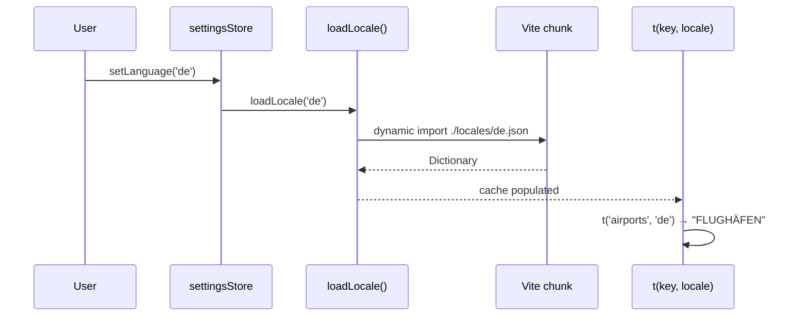
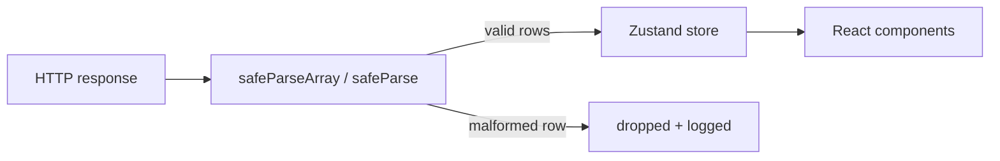

# AirWatch Web · Architecture

Reading time ~ 8 min. Read this before making structural changes.

## High-level data flow



* Every `fetch` from the browser that targets `/api/proxy/*` is rewritten by
  Next.js to `http://localhost:8080/*` (configurable via `NEXT_PUBLIC_PROXY_URL`).
* Live flight frames stream over the same-origin WebSocket `/ws/flights`.
  The [`liveFeed`](./src/lib/flights/liveFeed.ts) transport automatically falls
  back to HTTP polling when the socket drops.

## Folder layout

The App Router splits public + admin into two route groups so the
public bundle drops every admin payload via Next.js code-splitting.

```
src/
├── proxy.ts                 # Per-request CSP nonce + admin-host gate (was middleware.ts)
├── app/
│   ├── (public)/            # Public-shell routes — bundled for anonymous visitors
│   │   ├── /               ─ live map home
│   │   ├── airports/       ─ airport search + detail
│   │   ├── airlines/       ─ airline detail
│   │   ├── cargo/          ─ cargo tracking
│   │   ├── compare/        ─ side-by-side flight comparison
│   │   ├── dashboard/      ─ multi-airport dashboard
│   │   ├── flight/         ─ single-flight detail
│   │   ├── geofences/      ─ CRUD + draw
│   │   ├── globe/          ─ Cesium 3D (lazy chunk)
│   │   ├── replay/         ─ flight playback (2D)  + /3d (deck.gl, lazy chunk)
│   │   ├── saved/          ─ favorites
│   │   ├── search/         ─ global search
│   │   ├── settings/       ─ theme / units / language
│   │   ├── spotting/       ─ geolocation spotting
│   │   ├── stats/          ─ personal flight stats
│   │   └── error.tsx       ─ public route-group error boundary
│   ├── (admin)/             # Operator dashboard — gated to admin host
│   │   ├── adminSchemas.ts ─ Zod schemas for /admin/api/* (admin-bundle only)
│   │   ├── sourceMapResolver.ts ─ client-side de-min for stack traces
│   │   └── admin/
│   │       ├── dashboard/  ─ Phase 1–8 sections (KPI, port grid, alerts, …)
│   │       ├── cache/ endpoints/ errors/ events/ features/ health/
│   │       ├── incidents/ instances/ jobs/ ports/ probes/ quota/
│   │       ├── security/ settings/ system/ users/ webhooks/
│   │       ├── shared/     ─ AdminDataTable (TanStack), Live SSE consumer
│   │       └── error.tsx   ─ admin route-group error boundary (posts to /admin/api/frontend-errors)
│   ├── api/                 # Next-side API handlers (/api/web-vitals, /api/client-error, …)
│   ├── global-error.tsx     # Catches errors above route-group boundaries
│   └── layout.tsx           # Root layout
├── components/
│   ├── common/              ─ FlagImage, LogoImage, ManagedImage
│   ├── flight/              ─ FlightDetailsPanel + details/ subfolder
│   ├── geofence/            ─ GeoFenceDrawMap (Leaflet-Draw)
│   ├── layout/              ─ BottomNav, ThemeProvider, GlobalEffects, ServiceWorkerRegistrar
│   ├── map/                 ─ MapView + hooks (markers, labels, radar, routes)
│   ├── replay/              ─ FlightReplayMap
│   ├── search/              ─ SearchInput, ResultTile
│   └── ui/                  ─ NeonText, GlassPanel, StatusBadge (atoms)
└── lib/
    ├── apiFetch.ts          ─ fetch wrapper with typed error logging
    ├── constants.ts         ─ API URL builder, colors, config defaults
    ├── data/                ─ airports lazy-loader, airlines, city/country i18n
    ├── flights/             ─ airlabs schemas, liveFeed (WS↔polling fallback), REST clients
    ├── hooks/               ─ useMounted, useGeoFenceAlerts, useSquawkAlerts, …
    ├── i18n/                ─ TranslationKey union, lazy locale loader
    ├── schemas.ts           ─ Zod runtime validators for the public API boundary
    ├── stores/              ─ Zustand stores (flights, favorites, stats, …)
    ├── types/               ─ shared TS types
    └── utils/               ─ formatting, math, conversion

public/
├── manifest.json            # PWA manifest
├── sw.js                    # Service worker (4-tier offline fallback)
└── offline.html             # Static fallback served when nothing is cached
```

## Global effects on mount



* `GlobalEffects` is a client-only `null`-render component mounted at the
  root layout. It warms the airports cache and opens the long-lived WebSocket
  that delivers geo-fence alerts.

## State management

Each Zustand store owns a single concern. Stores persist to `localStorage`
where appropriate.

| Store | Persists? | Purpose |
|---|---|---|
| `flightStore` | no | live aircraft map, polling/WS handle, selection |
| `favoritesStore` | yes | user's starred flights / airports / airlines |
| `statsStore` | yes | personal view counter, capped at 500 entries |
| `settingsStore` | yes | theme, language, units, mapStyle, updateInterval |
| `geofenceStore` | yes | alert history (deduped, capped at `maxAlerts`) |

### Live-feed transport



## i18n pipeline



* `en.json` is eager-bundled (fallback).
* `de.json` / `fr.json` are code-split — Next.js emits them as separate chunks.
* `TranslationKey = keyof typeof enDictionary` gives compile-time safety.

## API boundary validation

Every fetch-result is parsed through a Zod schema before entering React state:



Single malformed entries are dropped, not fatal. Envelope-level failures log
and return an empty array so the UI degrades gracefully.

## Backend coupling

The frontend only knows the backend via `/api/proxy/*`, `/admin/api/*`,
`/admin/api/stats/ingest/*` (telemetry beacon allowed on the public host),
and `/ws/flights`. Contract drift is caught by:

1. Zod schemas at every fetch boundary — the public API in
   [`src/lib/schemas.ts`](./src/lib/schemas.ts) and the admin payloads in
   [`src/app/(admin)/adminSchemas.ts`](./src/app/(admin)/adminSchemas.ts)
   (admin schemas live under the admin route group so the public bundle
   drops them).
2. `npm run generate:api-types` — regenerates from SpringDoc OpenAPI when
   the backend is running.
3. [`contract.test.ts`](./src/lib/contract.test.ts) — executable shape docs.
4. [`src/proxy.test.ts`](./src/proxy.test.ts) — locks the CSP header
   contract (img-src CDN allowlist, connect-src ws/wss + rainviewer,
   nonce-only script-src).

## Source-map de-min for production stack traces

The admin shell ships [`sourceMapResolver.ts`](./src/app/(admin)/sourceMapResolver.ts)
— a 30 KB browser-side parser that fetches the matching `.js.map`
emitted by Next.js next to each chunk and rewrites a stack trace
in place. The `FrontendErrorsCard` exposes a per-row "Resolve" button
that runs the resolver on the raw stack so on-call sees real source
positions, not minified pseudo-frames. Failures fall back to the raw
stack — the operator never sees an empty pre-block.

## Build & deploy

| Step | Tool |
|---|---|
| Dev | `npm run dev` (port 3000, LAN-bind) |
| Build | `npm run build` (Next.js 16 + Turbopack) |
| Test | `npm test` (Vitest, multi-env: jsdom + node) |
| E2E | `npm run test:e2e` (Playwright) |
| Lint | `npm run lint` (ESLint 9 flat config) |
| Size (core+lazy3D) | `npm run size` (CI gate) |
| Size (admin) | `npm run size:admin` (CI artifact) |
| Lighthouse | `.lighthouserc.json` (CI; a11y ≥ 0.90 + CLS < 0.10 are hard asserts) |
| i18n parity | `npm run i18n:check --max 200` |
| Container | `docker build -t airwatch-web .` |

## Performance budgets

The bundle classifier in [`scripts/bundle-budget-lib.mjs`](./scripts/bundle-budget-lib.mjs)
splits chunks into a CORE bucket (every-user code) and a LAZY-3D
bucket (Cesium + deck.gl, gated behind `/globe` and `/replay/3d`).

| Bucket | Budget (gzip) | Headroom rule |
|---|---|---|
| Core | 1.0 MB | Adding a static import that touches a heavy lib trips this first |
| Lazy 3D | 1.8 MB | Cesium + deck.gl headroom for routine version bumps |
| Per-chunk max | 1.5 MB | Catches a single-chunk doubling regression |
| CSS (raw) | 150 KB | Tailwind doesn't compress much; raw is the honest measure |
| Admin perf | per-page ≤ 1.5 MB / total ≤ 5.5 MB (gzip) | Run via `npm run size:admin --json` |

## Adding a new feature

1. **Type contract first** — add the schema to [`src/lib/schemas.ts`](./src/lib/schemas.ts)
   or a feature-local schema file.
2. **REST client** under `src/lib/flights/` using `apiFetch` + `safeParse`.
3. **Store** under `src/lib/stores/` (Zustand). Persist only when it's user data.
4. **Component(s)** with tests colocated (`Component.test.tsx`).
5. **Translations** — add a key to `en.json`; DE/FR follow. The parity test
   fails fast if you forget one.
6. **E2E smoke** — add a spec in `e2e/` if the feature has its own route.

## Deliberate non-goals

* No user accounts — `clientId` comes from `localStorage`.
* No offline-first — relies on backend for live data. Cached airports and
  i18n bundles are the only persistent assets.
* No native mobile apps. PWA install is supported (manifest at
  `/manifest.json`, service worker registered via
  [`ServiceWorkerRegistrar.tsx`](src/components/layout/ServiceWorkerRegistrar.tsx))
  but offline browsing is intentionally not implemented — the app degrades
  to "no live data" when the backend is unreachable.
